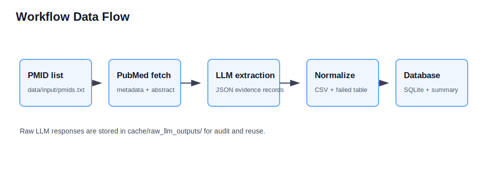
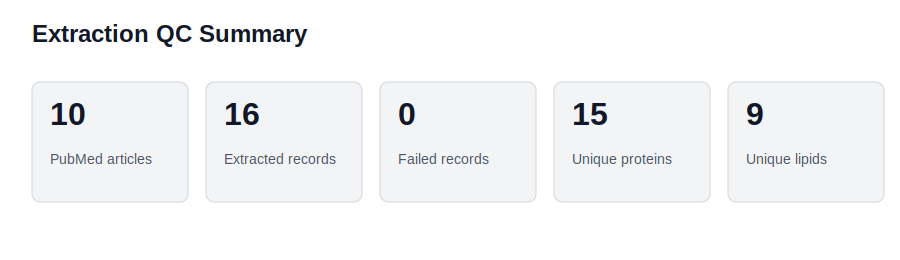
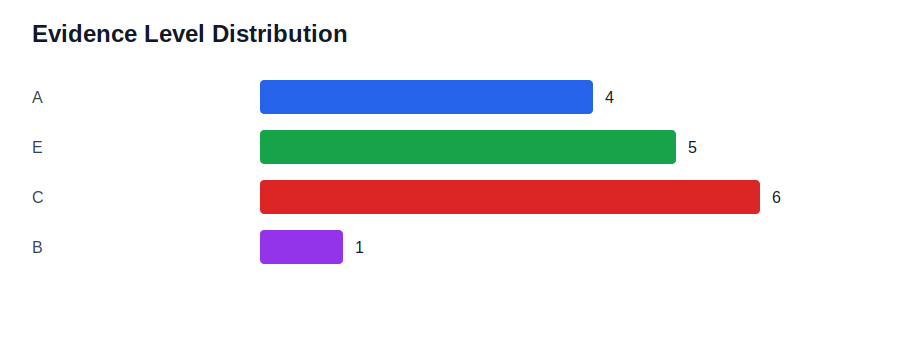
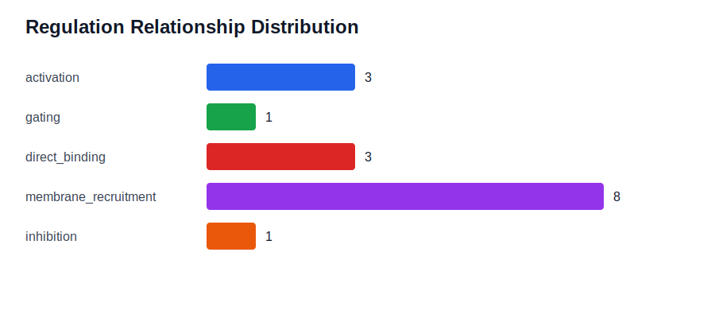

# 基于 LLM 的受磷脂调控蛋白质论文信息挖掘与数据库建立

作者：熊一川（学号：524111910027）

GitHub 仓库：[https://github.com/Zhaimiaoyizhi/phospholipid-llm-mining](https://github.com/Zhaimiaoyizhi/phospholipid-llm-mining)

## 中文摘要

受磷脂调控的蛋白质广泛参与膜定位、离子通道门控、信号转导和细胞器间物质转运等过程，但相关证据往往分散在不同论文的题名、摘要、图表和实验描述中，人工整理耗时且容易遗漏。本项目面向“受磷脂调控的蛋白质论文信息挖掘与数据库建立”这一后续课题，完成了一个可在一天内稳定验收的最小可行流程（MVP）：以 PubMed PMID 列表作为输入，通过 NCBI E-utilities 下载论文题名、摘要和元信息，使用 OpenAI-compatible 大语言模型接口按照预定义字段表抽取蛋白质、脂质、调控关系、证据句、实验方法和人工复核状态等结构化信息，并进一步生成 CSV 表格、SQLite 数据库、运行摘要与报告图表。流程由 Snakemake 统一管理，计算环境由 Conda 固化在 `environment.yml` 中，同时提供 Windows 双击式一键运行脚本，支持首次环境检查、LLM 参数引导、缓存复用和覆盖/追加两种运行模式。

本次示例数据包含 10 篇 PubMed 文献，共抽取得到 16 条候选记录，覆盖 15 个报道蛋白和 9 种报道脂质，失败记录数为 0。结果显示，示例文献中最常见的关系类型为膜募集，其次为直接结合和激活；证据等级以结构证据、功能证据、摘要级证据和高通量筛选证据混合构成。需要强调的是，本项目当前重点是课程要求中的环境、数据获取、流程管理、结果发布和可复现实验框架，而不是追求最终数据库的高精度抽取效果。所有 LLM 输出均保留原始响应并将复核状态标记为 `pending`，为后续人工校对和字段体系优化留下接口。

关键词：磷脂调控；蛋白质数据库；PubMed；大语言模型；Snakemake；SQLite

## Abstract

Phospholipid-regulated proteins are involved in membrane recruitment, ion-channel gating, signal transduction, and inter-organelle lipid transport. However, the supporting evidence is scattered across individual papers and is difficult to curate manually at scale. This project implements a minimum viable workflow for literature-based information mining and database construction. Starting from a list of PubMed IDs, the workflow retrieves publication metadata and abstracts through NCBI E-utilities, uses an OpenAI-compatible large language model to extract structured phospholipid-protein regulation records, normalizes the records into CSV format, builds a SQLite database, and generates summary statistics and report figures.

The computational workflow is managed by Snakemake and the software environment is defined in a Conda `environment.yml` file. A guided Windows one-click runner is also provided for practical course demonstration, including environment checks, LLM configuration guidance, cache reuse, and append/overwrite execution modes. In the demonstration run, 10 PubMed articles produced 16 candidate records, involving 15 reported proteins and 9 reported lipid species, with zero failed records. The current version emphasizes reproducible engineering structure rather than optimized extraction accuracy. Raw LLM responses are cached for audit, and all extracted records are marked as pending manual review. Repository: [https://github.com/Zhaimiaoyizhi/phospholipid-llm-mining](https://github.com/Zhaimiaoyizhi/phospholipid-llm-mining).

Keywords: phospholipid regulation; protein database; PubMed; large language model; Snakemake; SQLite

## 前言（Introduction）

磷脂不仅是细胞膜的结构成分，也是重要的调控分子。磷脂酰肌醇磷酸类、磷脂酰丝氨酸、磷脂酸等脂质可以通过改变膜表面电荷、提供结合位点、招募蛋白结构域或稳定蛋白构象，影响离子通道、激酶、转运蛋白和膜交通相关因子的功能。对于后续“受磷脂调控的蛋白质数据库”建设而言，关键问题并不只是找到论文，而是把论文中的证据转化为可检索、可复核、可扩展的结构化字段。例如，同一篇论文可能同时涉及蛋白名称、基因符号、脂质种类、结合结构域、突变实验、调控方向、细胞定位、实验方法和原文证据句。如果只靠自由文本笔记，很难形成稳定的数据资产。

本课程项目选择该题目，是因为它与既有的“磷脂-蛋白相互作用数据库整理”和“膜酶检索数据库”工作相关，但不是简单重复。过去的工作主要集中在字段设计、检索思路和数据库整理。本项目进一步补齐了工程化流程：从论文数据库下载原始数据，到 LLM 抽取，再到标准化输出、数据库构建、结果统计和文档发布，形成可以复现实验的自动化框架。与传统 RNA-seq 或 ATAC-seq 课程项目相比，本项目的数据对象不是测序 reads，而是论文数据库中的原始文献元信息与摘要；但它仍然满足“数据获取、环境搭建、流程管理、结果发布”的核心训练目标，并且更贴近本人后续研究方向。

本项目的科学问题可以概括为：能否构建一个可复现的文献挖掘流程，从 PubMed 文献中自动识别“蛋白质是否受到特定磷脂调控”以及“该调控由什么实验和证据支持”？在本次 MVP 中，研究目标被有意识地收窄为三点。第一，建立清晰稳定的项目结构，使老师或同学能够从 README 和一键脚本复现实验。第二，把字段表转化为 LLM 提示词和结构化输出规范，使未来人工校对和数据库扩展有统一入口。第三，生成可用于报告的结果表格、SQLite 数据库和核心统计图，展示流程已经完整跑通。

## 数据集与方法（Methods）

### 数据集来源与元信息

本项目的数据来源是 PubMed 论文数据库，程序通过 NCBI E-utilities 根据 PMID 下载论文题名、摘要、期刊、年份、DOI 等元信息。由于本题目已经由任课教师接受为“通过论文数据库选择并下载原始数据”的替代型项目，本报告中的“Accession Number”对应 PubMed ID；“测序平台”不适用，改写为“数据平台/数据库”。示例运行使用 10 篇种子文献，主要围绕 phosphoinositide、PIP2、phosphatidylserine 等脂质对蛋白功能或定位的调控。

| 项目 | 内容 |
|---|---|
| 数据库 | PubMed / NCBI E-utilities |
| 原始数据类型 | 论文题名、摘要与文献元信息 |
| Accession Number | PMID |
| 示例样本量 | 10 篇论文 |
| 输入文件 | `data/input/pmids.txt` |
| 测序平台 | 不适用；本项目为文献挖掘而非测序数据分析 |
| 输出数据 | CSV 结构化记录、SQLite 数据库、JSON 运行摘要、SVG 报告图 |

示例 PMID 列表如下：40172963、31683182、28358046、29020060、21971045、29848549、34267198、36071159、37175801、23270460。

### 计算环境与工具版本

项目使用 Conda 管理环境，环境名称为 `phospholipid-llm-mining`。主要工具包括 Python、Snakemake、requests、pandas、PyYAML、python-dotenv 和 pytest。实际验收环境中，Python 版本为 3.11.15，Snakemake 版本为 9.23.1，pandas 版本为 3.0.3，requests 版本为 2.34.2，PyYAML 版本为 6.0.3。`environment.yml` 已提交到仓库，能够用于创建标准化运行环境。

LLM 调用使用 OpenAI-compatible Chat Completions 接口。本次本地配置采用 DeepSeek 兼容接口与 `deepseek-v4-flash` 模型；为了避免泄露密钥，仓库只提交 `.env.example`，真实 `.env` 文件被 `.gitignore` 排除。运行脚本会在首次运行时引导用户填写 API key、base URL 和模型名称。

### 自动化流程设计

流程管理采用 Snakemake。工作流从 PMID 列表开始，依次执行 PubMed 下载、输入准备、LLM 信息抽取、字段标准化、SQLite 数据库构建和统计摘要生成。每个步骤都有明确输入与输出，因此当中间文件已经存在且没有变化时，Snakemake 可以自动跳过不需要重跑的任务。LLM 原始输出按 PMID 缓存在 `results/raw_llm_outputs/` 或用户指定输出目录的 `cache/raw_llm_outputs/` 中，追加模式下可复用已成功抽取的结果，避免重复消耗 API 调用。

图 1 展示了项目的数据流向。该流程图由 `scripts/make_report_figures.py` 根据项目结构生成并嵌入报告。



图 1. 基于 PubMed PMID 的文献挖掘流程图。输入为 PMID 列表，流程依次完成 PubMed 元信息下载、LLM 抽取、字段标准化、数据库构建和结果汇总。原始 LLM 响应被缓存用于审计、复核和增量运行。

### 字段规范与质量控制策略

字段设计沿用既有“受磷脂调控蛋白质数据库”记录模板的思想，核心字段包括蛋白名称、基因符号、物种、蛋白类型、生理功能、脂质名称、脂质类别、调控关系、直接/间接证据、功能效应、机制摘要、细胞环境、膜区室、结合结构域、突变实验、疾病相关性、图表位置、原始证据句、实验方法、证据等级、复核状态、LLM 置信度和歧义标记等。提示词要求模型忠于原文、简洁表达、不能凭空补充，并在信息不足时留空或标记不确定。

质量控制分为三层。第一层是输入 QC：PMID 文件允许注释行，脚本会忽略空行和以 `#` 开头的行。第二层是抽取 QC：LLM 原始 JSON 被逐条保存，解析失败或字段不合规的记录写入 `failed_records.csv`，避免静默丢失。第三层是人工复核接口：所有候选记录默认 `review_status=pending`，提醒使用者这些记录是机器辅助抽取结果，而不是已经审核通过的最终数据库条目。

## 结果（Results）

### 数据获取与抽取 QC 结果

示例流程成功处理 10 篇 PubMed 文献，生成 16 条候选磷脂-蛋白调控记录，涉及 15 个报道蛋白和 9 种报道脂质。失败记录数为 0，说明在当前示例输入和模型配置下，工作流能够稳定完成从原始文献元信息到结构化结果的转换。需要注意的是，失败记录数为 0 只代表脚本层面没有解析失败，并不等同于所有抽取内容均已生物学确认；因此数据库记录仍保留待复核状态。



图 2. 信息抽取质量控制摘要。图中展示了示例运行的论文数量、抽取记录数、失败记录数、唯一报道蛋白数和唯一报道脂质数。该图对应 `results/extraction_summary.json` 中的统计结果。

### 证据等级分布

本项目将抽取记录按证据层级进行初步分类。示例结果中，A级证据 4 条，E 级证据 5 条，C 级证据 6 条，B 级证据 1 条。A级记录通常包含结构、生化或功能实验支持，例如 cryo-EM、表面等离子共振、电生理或突变实验证据；B 级记录主要体现高通量或筛选类发现；C 和 E 级记录更多依赖摘要或较概括的实验描述。这样的证据分布提示后续数据库建设不能只保存“是否有调控关系”，还应保留证据类型和原始句子，方便人工评估可靠性。



图 3. 候选记录的证据等级分布。不同等级反映抽取证据的直接性和可验证程度。该图不是最终人工审定结果，而是流程运行后的机器辅助初筛统计。

### 调控关系类型分布

示例数据中，膜募集关系出现 8 条，是最常见类型；激活关系 3 条，直接结合关系 3 条，门控关系 1 条，抑制关系 1 条。这与磷脂调控蛋白的常见机制相符：许多蛋白通过 PH 结构域、碱性氨基酸簇或其他膜结合模块识别特定磷脂，从而被招募到质膜、Golgi 或其他膜区室；离子通道则常见 PIP2 依赖性激活或门控稳定；部分蛋白的调控还可能体现为竞争结合、构象抑制或运输活性变化。



图 4. 候选记录的磷脂-蛋白调控关系类型分布。该图替代传统转录组报告中的 PCA 图或火山图，因为本项目的数据对象不是表达矩阵，而是文献证据抽取记录。

### 代表性抽取结果

在示例记录中，KCNQ5 与 PIP2 的关系被抽取为直接激活，机制摘要涉及 PIP2 在不同构象下结合电压感受结构域和孔区界面，并结合电生理与 cryo-EM 证据解释通道激活。TASK-2 与 PI(4,5)P2 的关系被抽取为直接结合和功能依赖，摘要中提到 PI(4,5)P2 耗竭导致通道活性下降，而外源 PI(4,5)P2 可恢复活性。PDK1 与 phosphatidylserine 的记录显示，磷脂酰丝氨酸可通过 PH 结构域相关位点影响 PDK1 的质膜定位和信号功能。CERT 与 PI4P 的记录则体现了磷脂结合、蛋白磷酸化状态和 Golgi 定位之间的耦合关系。

这些结果说明，字段体系能够覆盖不同层面的磷脂调控：有些关系强调结构性结合，有些关系强调离子通道功能，有些关系强调亚细胞定位，还有些关系体现多因素调控。对课程作业而言，这证明流程不仅能生成文件，而且能产生有生物学解释空间的结构化结果。

## 讨论（Discussion）

从生物学意义上看，示例结果支持一个核心认识：磷脂调控并不是单一类型的“结合事件”，而是贯穿膜蛋白功能、信号蛋白定位和膜交通过程的多层调控方式。PIP2 对 KCNQ、TASK 和 TMEM16A 等离子通道的调控说明，膜脂可以作为通道门控和构象稳定的重要条件；磷脂酰丝氨酸对 PDK1 的影响说明，非磷酸化磷脂也能提供定位和信号调节信息；PI4P 与 CERT 的关系则提示脂质识别和蛋白自身修饰之间存在调控耦合。若未来扩大文献规模，这类数据库可以帮助研究者快速回答“某个蛋白是否受某种磷脂调控”“证据来自结构实验还是功能实验”“调控主要影响定位、活性还是结合”等问题。

本项目的主要贡献是工程框架，而不是最终知识库。它将过去比较零散的字段设计转化为可运行流程，把人工整理任务拆成数据获取、模型抽取、字段标准化、数据库写入和人工复核几个边界清楚的模块。Snakemake 的引入使流程具有可重复性和可增量运行能力；SQLite 输出使后续检索、统计和 Web 展示成为可能；一键脚本降低了课程验收时的操作门槛。这些设计对后续课题也有实际价值，因为真正的数据库建设往往不是一次性脚本，而是需要长期迭代的数据生产线。

局限性也很明显。第一，本次只使用题名和摘要，很多关键信息实际存在于全文、图注、补充材料或方法部分，因此字段可能不完整。第二，LLM 可能出现幻觉、过度推断或把背景知识误写成原文证据，因此必须保留原始证据句和复核状态，不能把机器结果直接视为最终数据库。第三，目前的规范化仍较浅，例如蛋白名称未完全映射到 UniProt，脂质名称未完全映射到 LIPID MAPS，本体化和同义词归一化仍需加强。第四，API 调用受网络、费用、模型版本和参数影响，不同模型可能给出不同抽取结果。第五，当前证据等级规则仍偏启发式，需要在更多人工标注样本上校准。

后续改进方向包括：接入 PubMed Central 或开放全文数据，扩展至图表和补充材料；引入 UniProt、NCBI Gene、LIPID MAPS 等外部数据库进行实体标准化；建立人工审核界面和审核日志；用少量人工金标准记录评估 precision、recall 和字段级一致性；增加多模型对照和提示词版本管理；将 SQLite 数据库进一步发布为可检索网页或轻量 API。若课程时间允许，还可以把 `review_status` 从简单的 pending 扩展为 accepted、rejected、needs_full_text 等状态，以支持真正的数据库维护。

### AI 协同反思

本项目本身使用 LLM 进行文献抽取，同时也使用 AI 辅助编写脚本、梳理 README、设计 Snakemake 流程和排查运行问题。AI 的优势在于能快速把需求拆成模块，并将重复性的工程模板转换为可运行代码。例如，PubMed 下载、JSONL 准备、LLM 调用、CSV 标准化和 SQLite 建库这些环节，都适合在清楚边界下由 AI 辅助生成初稿。它也能帮助检查课程要求是否被遗漏，例如 `environment.yml`、`.gitignore`、一键运行脚本、流程图和报告附录。

但 AI 辅助也带来风险。最大风险不是语法错误，而是“看起来合理但不真实”的细节：模型可能虚构字段、夸大证据、误判实验方法，或在报告中把文献挖掘项目错误写成测序分析项目。因此，本项目采用了几条约束：提示词要求忠于原文，抽取结果必须保留原始证据句，缺失信息不强行补全，所有记录默认待人工复核，真实 API key 不进入仓库。对编程过程而言，AI 提高了搭建速度，但最终可靠性仍依赖明确的需求边界、可运行的测试、版本控制和人工验收。

## 参考文献（References）

Fahy, E., Subramaniam, S., Murphy, R. C., Nishijima, M., Raetz, C. R. H., Shimizu, T., Spener, F., van Meer, G., Wakelam, M. J. O., & Dennis, E. A. (2009). Update of the LIPID MAPS comprehensive classification system for lipids. *Journal of Lipid Research, 50*(S), S9-S14. https://doi.org/10.1194/jlr.R800095-JLR200

Köster, J., & Rahmann, S. (2012). Snakemake: A scalable bioinformatics workflow engine. *Bioinformatics, 28*(19), 2520-2522. https://doi.org/10.1093/bioinformatics/bts480

National Center for Biotechnology Information. (2024). *Entrez Programming Utilities Help*. NCBI Bookshelf. https://www.ncbi.nlm.nih.gov/books/NBK25501/

The UniProt Consortium. (2023). UniProt: The Universal Protein Knowledgebase in 2023. *Nucleic Acids Research, 51*(D1), D523-D531. https://doi.org/10.1093/nar/gkac1052

Van Rossum, G., & Drake, F. L. (2009). *Python 3 Reference Manual*. CreateSpace.

SQLite Consortium. (2024). *SQLite Documentation*. https://www.sqlite.org/docs.html

## 附录（Appendix）

### 附录 A：environment.yml

```yaml
name: phospholipid-llm-mining
channels:
  - defaults
  - conda-forge
dependencies:
  - python=3.11
  - pyyaml[version='>=6.0']
  - pip
  - requests[version='>=2.31']
  - pandas[version='>=2.2']
  - python-dotenv[version='>=1.0']
  - snakemake-minimal[version='>=8']
  - pytest[version='>=8']
```

### 附录 B：关键 Snakemake 规则节选

```python
rule all:
    input:
        PATHS["summary_json"],
        PATHS["sqlite_db"],
        PATHS["normalized_csv"],
        PATHS["failed_csv"]

rule fetch_pubmed:
    input:
        pmids=PATHS["pmids"]
    output:
        articles=PATHS["articles_csv"]
    shell:
        """
        python scripts/fetch_pubmed.py \
          --pmids {input.pmids} \
          --output {output.articles} \
          --email "{PUBMED[email]}" \
          --tool "{PUBMED[tool]}" \
          --batch-size {PUBMED[batch_size]} \
          --timeout {PUBMED[timeout_seconds]}
        """
```

### 附录 C：一键运行方式

Windows 用户可以双击项目根目录下的 `run_project.bat`，按提示输入 PMID 列表文件、输出目录和运行模式。命令行用户也可以使用：

```powershell
.\run_project.ps1 -PmidsFile "D:\path\pmids.txt" -OutDir "D:\path\output" -Mode append
```

输出目录结构如下：

```text
用户指定输出目录/
├── input/
├── cache/
├── results/
└── logs/
```

其中 `results/extracted_records.csv` 为结构化宽表，`results/phospholipid_protein.sqlite` 为 SQLite 数据库，`results/extraction_summary.json` 为统计摘要，`cache/raw_llm_outputs/` 保存按 PMID 缓存的原始 LLM 输出。

### 附录 D：核心输出文件

```text
results/extracted_records.csv
results/failed_records.csv
results/phospholipid_protein.sqlite
results/extraction_summary.json
docs/figures/workflow_flowchart.svg
docs/figures/extraction_qc_summary.svg
docs/figures/evidence_level_counts.svg
docs/figures/regulation_relationship_counts.svg
```
